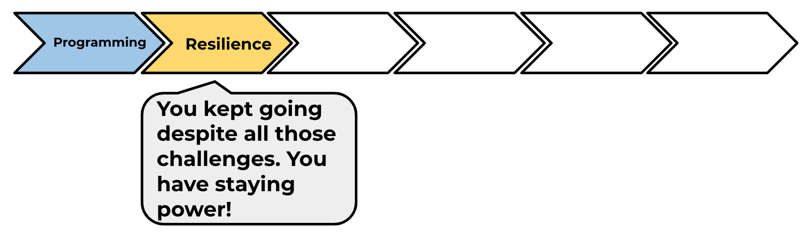

## What next?

Have a go at our 'Brain game' project, in which you can create your own maths quiz.

You will find this project in the module pathway.

--- no-print ---
Click the button to start. Type in the answer to the question, and then press the <kbd>Enter</kbd> key.

  <iframe allowtransparency="true" width="485" height="402" src="https://scratch.mit.edu/projects/embed/250234955/?autostart=false" frameborder="0" scrolling="no"></iframe>
  

--- /no-print ---

--- print-only ---

--- /print-only ---

